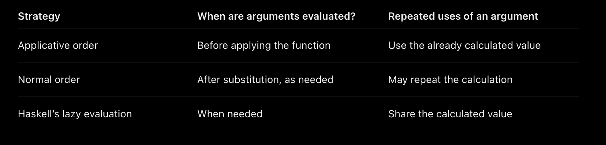

# 1 - Types of Evaluation

## 1.1 - Applicative Order evaluations

evaluate the arguements first, then apply the function  
in `f( g(x) )`, evaluate `g(x) = y` first then evaluate `g(y)`

ie.

```haskell
square (2 + 3)
→ square 5
→ 5 * 5
→ 25
```

## 1.2 - Normal Order evaluation

apply the function first, then evaluate the arguement only if needed  
in `f( g(x) )`, create the entire expression with `g(x)` substituted into `f()`

ie.

```haskell
square (2 + 3)
→ (2 + 3) * (2 + 3)
→ 5 * (2 + 3)
→ 5 * 5
→ 25
```

**To help remember: normal is not how I would normally evaluate**

## 1.3 - Some Intuition

Intuitvely: Applicative seems more effecient because the same expression is computed multiple times in normal order

however take this example:

```haskell
first x y = x
first (5+2) (10*20)
```

Applicative would do

```haskell
first (5+2) (10*20)
first 7 200
7
```

Normal would do

```haskell
first (5+2) (10*20)
(5+2)
7
```

Intuition to be built is that

- normal order can avoid evaluating expressions that don’t contribute to the answer

## 1.4 - Church Roser Theorem

- if the evaluation terminates, then the two evaluation strategies will agree
- if the expression can terminate, normal evaluation will find it

For example, take this:

```haskell
loop :: int
loop = loop
first 4 loop
```

applicative:

```haskell
first 4 loop
first 4 loop
first 4 loop
...
```

this is because it will try to evaluate `loop` until it evaluate `first`

normal:

```haskell
first 4 loop
4
```

## 1.5 - What Haskell actually does: Lazy Evaluating

1. Delay evaluating an argument until its value is needed.
2. Once evaluated, share the result so it doesn’t need to be calculated again.

```haskell
square ( 2+3 )
```

so:

x refers to one shared, delayed calculation: `2 + 3`

```haskell
square x
x * x
```

- multiplication needs `x`
- haskell calculates `x` (`2+3 = 5`) and uses that same result for both occurrences

```haskell
5 * 5
25
```

## 1.6 - Strategy comparsion



# 2 - Tail recursion

Tail recursion means that the recursive call is the last operation a function performs. There is no work left to do after that call returns.

## 2.1 - What is the difference between normal recursion and tail recursion?

#### 2.1.1 Normal Recursion

```haskell
fact :: Integer -> Integer
fact 0 = 1
fact n = n * fact(n-1)
```

in normal recursion, when call stack folds back, there is a piece of computation in each layer

#### 2.1.2 Tail Recursion

pow2 is a method which shows returns True only if x is a power of 2

```haskell
pow2 :: Integer -> Bool
pow2 1 = True
pow2 x
    | x<=0          = pow2 x/2
    | x `mod` 2 == 0 = pow2 (x `div` 2)
    | otherwise     = False
```

there is no other computation when the call stack folds back

Because Haskell is lazy, tail recursion alone does not guarantee constant memory use. An accumulator can still build up deferred computations unless it is evaluated strictly.

# 3 - Tuples

A tuple groups a fixed number of values into one value. The values can have different types.

```haskell
person :: (String, Int)
person = ("Naman", 19)
```

The type `(String, Int)` means the first value is a string and the second is an integer. The order and number of values matter.

Haskell has no conept of a single element tuple - (42) :: (Int) = 42 :: Int
- () is a zero element tuple - called a single unit
- (23) = 23
- (23,4) is two element tuple

## 3.1 - Accessing Values

you can use either:
- pattern matching
- fst or snd for two element tuples

```haskell
dist :: (Double, Double) → (Double, Double) → Double
dist (x0, y0) (x1, y1) = sqrt ((x0 − x1) ˆ 2 + (y0 − y1) ˆ 2)
```

For a pair, use `fst` and `snd`:

```haskell
fst ("Naman", 19)   -- "Naman"
snd ("Naman", 19)   -- 19
```

For any tuple size, use pattern matching:

```haskell
getAge :: (String, Int) -> Int
getAge (_, age) = age
```

`_` means we ignore that value.

## 3.2 - Returning Multiple Results

```haskell
sumAndProduct :: Int -> Int -> (Int, Int)
sumAndProduct x y = (x + y, x * y)

sumAndProduct 3 4   -- (7, 12)
```

The function returns one tuple containing both results.


# 4 - Polymorphism

Polymorphism means a function can work with different types.

## 4.1 - Identity

The identity function returns its input unchanged:

```haskell
identity :: a -> a
identity x = x

identity True    -- True
identity "hi"    -- "hi"
```

`a` is a **type variable** that can represent any type. Using the same variable means the input and output have the same type.

## 4.2 - Parametric Polymorphism

A function has parametric polymorphism when it works with any type, without requiring particular operations on that type.

```haskell
first :: (a, b) -> a
first (x, y) = x

first (3, True)    -- 3
first ("hi", 7)    -- "hi"
```

`a` and `b` can be different types, but do not have to be. The function simply returns the first value, regardless of its type.

`identity` is also an example of parametric polymorphism.

## 4.3 - Constrained Polymorphism

A function has constrained polymorphism when it works with different types that satisfy a **type class constraint**.

```haskell
double :: Num a => a -> a
double x = x + x

double 3       -- 6
double 2.5     -- 5.0
```

`Num a` means `a` must be a numeric type, because the function uses `+`.

`=>` separates the constraints from the rest of the signature.

Common constraints:

- `Num a`: supports numeric operations such as `+` and `*`.
- `Eq a`: supports equality comparisons using `==` and `/=`.
- `Ord a`: supports ordering comparisons such as `<` and `>`.

## 4.4 - Infix and Prefix Style

**Infix** places a function or operator between its arguments. **Prefix** places it before its arguments.

Operators normally use infix style. Add parentheses to use them in prefix style:

```haskell
3 + 4      -- infix
(+) 3 4    -- prefix
```

Ordinary functions normally use prefix style. Add backticks to use a two-argument function in infix style:

```haskell
div 10 2      -- prefix
10 `div` 2    -- infix
```

Both styles mean the same thing. An operator’s name is parenthesised when writing its type signature:

```haskell
(+) :: Num a => a -> a -> a
```

## 4.5 - Function Composition `(.)`

The composition operator `(.)` is provided by `Prelude`, which is normally imported automatically.

It combines two functions by passing the result of one into the other:

```haskell
(f . g) x = f (g x)
```

`g` is applied to `x`, then `f` is applied to the result.

```haskell
addOne x = x + 1
double x = x * 2

(double . addOne) 3
-- double (addOne 3)
-- double 4
-- 8
```

Its type signature is:

```haskell
(.) :: (b -> c) -> (a -> b) -> a -> c
```

- `g :: a -> b`: takes the input and produces an intermediate result.
- `f :: b -> c`: takes that intermediate result and produces the final result.
- `f . g :: a -> c`: the combined function.

Arrows associate to the right, so the signature can also be written:

```haskell
(.) :: (b -> c) -> (a -> b) -> (a -> c)
```

This means `(.)` takes two compatible functions and returns a new function. The type variables make it polymorphic.

Infix and prefix forms are equivalent:

```haskell
f . g
(.) f g
```

**Parentheses matter:** `f g x` means `(f g) x`, whereas composition uses `f (g x)`.


# 5 - Lambda Abstraction

```haskell
f :: a -> b
f x = y
```

to isolate f, we use a lamda abstraction

```haskell
f :: a -> b
f = λ x -> y
```


consider difference between:

```haskell
add: Int -> Int -> Int
add x y = x + y
```

```haskell
add x y = x + y
add x = λy -> x + y
```

```haskell
a -> b -> c = a -> (b -> c)
```


```haskell
plus :: (Int, Int) -> Int
plus (x,y) -> x + y
```


curry :: ( (a,b) -> c) -> (a -> b -> c)
curry f x y = f(x,y)

uncurry :: (a -> b -> c) -> ( (a,b) -> c )
uncurry g(x,y) = g x y


??what is id subscript(int) = id@int :: Int -> Int??

??what is currying??

excercise:
curry . uncurry = id
uncurry . curry = id


# 6 - Data types

bool is describes as:

```haskell
data Bool where
    True :: Bool
    False :: Bool
```

You can use this to define your own datatypes:

```haskell
data day where
    Monday :: day
    Tuesday: day
    ...
```

You can this type as any other and define functions by pattern matching

```haskell
weekend :: Day -> Bool
weekend monday = False
...
weekend saturday = True
...
```

Alternatively:

```haskell
data Day = Monday | Tuesday | Wednesday ... 
```


```haskell
data Natural where
    zero :: Natural
    succ :: Natural -> Natural
```


# 7 - Type Classes


A type class decides a family of operations undefined by a type eg.


?? go over classes ??


# Type synonyms

